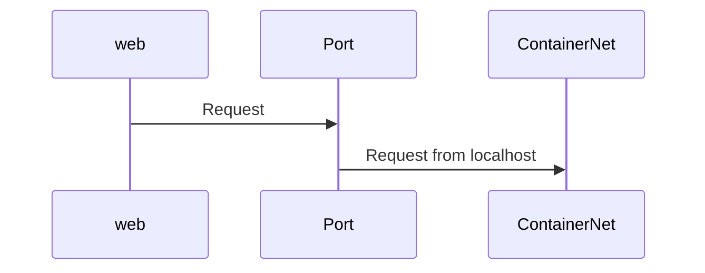

## Creating a DockerFile
+ Especificar una imagen base
+ Ejecutar comandos para programas iniciales
+ Especificar comanto a ejecutar cuando el contenedor inicie

```sheet
| Instruccion de que hacer a docker | Argumento de la instruccion |
| FROM | alphine |
| RUN | apk add --update redis |
| CMD | ["redis-server"]|
```

```Dockerfile
# Use an existing docker image as a base
FROM alpine 

# Download and install a dependency
RUN apk add --update redis

# Tell the image what do to when it starts as a container
CMD ["redis-server"]

```

Para construir una imagen, una vez que tenemos el Dockerfile completo, nos situamos en la carpeta contenedora y escribimos en la terminal: 
```zsh
docker build .
```

## Nombrando una imagen
```zsh
docker build -t stephengrider/redis:latest .
```
+ -t: Para nombrar la imagen
```sheet
|-t stephengrider/redis:latest| < | < | < | < |
|stephengrider| / | redis | : | latest |
| Nombre del Docker ID | | Repo/Project Name |  |  Version |
```

## Creando un Dockerfile para NodeJs

```sheet
| Instruccion de que hacer a docker | Argumento de la instruccion |
| FROM | alphine |
| RUN | npm install |
| CMD | ["npm", "dev"]|
```

```Dockerfile
#Specify a base image
FROM alpine

#Install some dependencies
RUN npm install

#Default command
CMD ["npm", "dev"]
```
## Agregar los archivos de node a la imagen
![[02.-Docker CLI#Copiar una carpeta desde nuestro sistema a docker]]
```Dockerfile
#Specify a base image
FROM alpine

#Copy all the current files to te current directory of the image
COPY ./ ./
#Install some dependencies
RUN npm install

#Default command
CMD ["npm", "dev"]
```
## Container Port
Docker Container Network se refiere a la capacidada que tienen los contenedores de comunicarse con otros contenedores o con la maquina principal en sí.
Por defecto cunado creamos un contenedor, este no exopne ningun puerto al mundo exterior. Sera necesario urilizar la bandera --publish o -p para hacer un puerto disponible para servicios externos a Docker. Esto crea una regla de firewall en el host, mapeando un puerto del contenedor a un puerto en el host Docker al mundo esterior.

```zsh
docker run -p 8080:8080 <image id>
```
-p: exponer puerto
```sheet
| 8080 | 8080 |
| Puerto desde donde viene el request local| Puerto dentro del contenedor|
```

## Especificando el directorio de trabajo
```Dockerfile
WORKDIR usr/app
```

## Evitando reBuilds innecesarios
Cada vez que hacemos un cambio en los archivos, estos se vuelven a copiar y a instalar nuevamente en el contenedor, para evitar esto, agregaremos otra instruccion para que solamente se instalen las dependencias si solo ese archivo es cambiado, en este caso como estamos trabajando en una aplicacion de nodejs, el archivo que escucharemos sera el package.json
```Dockerfile
# Specify a base image
FROM node:14-alpine

# Specify Workdir Directory
WORKDIR /usr/app

# Install some dependencies
COPY ./package.json ./
RUN npm install
COPY ./ ./

# Default command
CMD ["npm", "run", "dev"]
```
Y asi quedaria un pseudo funcional archivo de Docker.